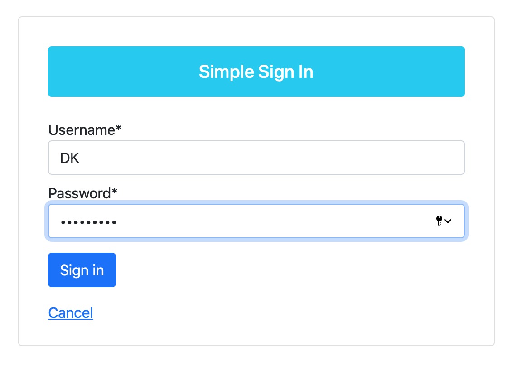
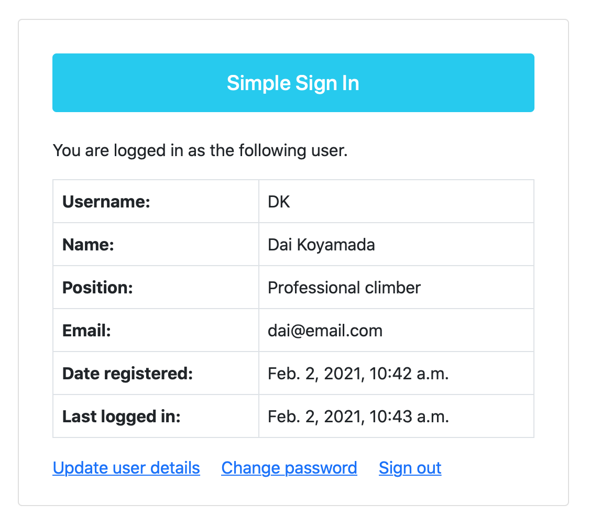
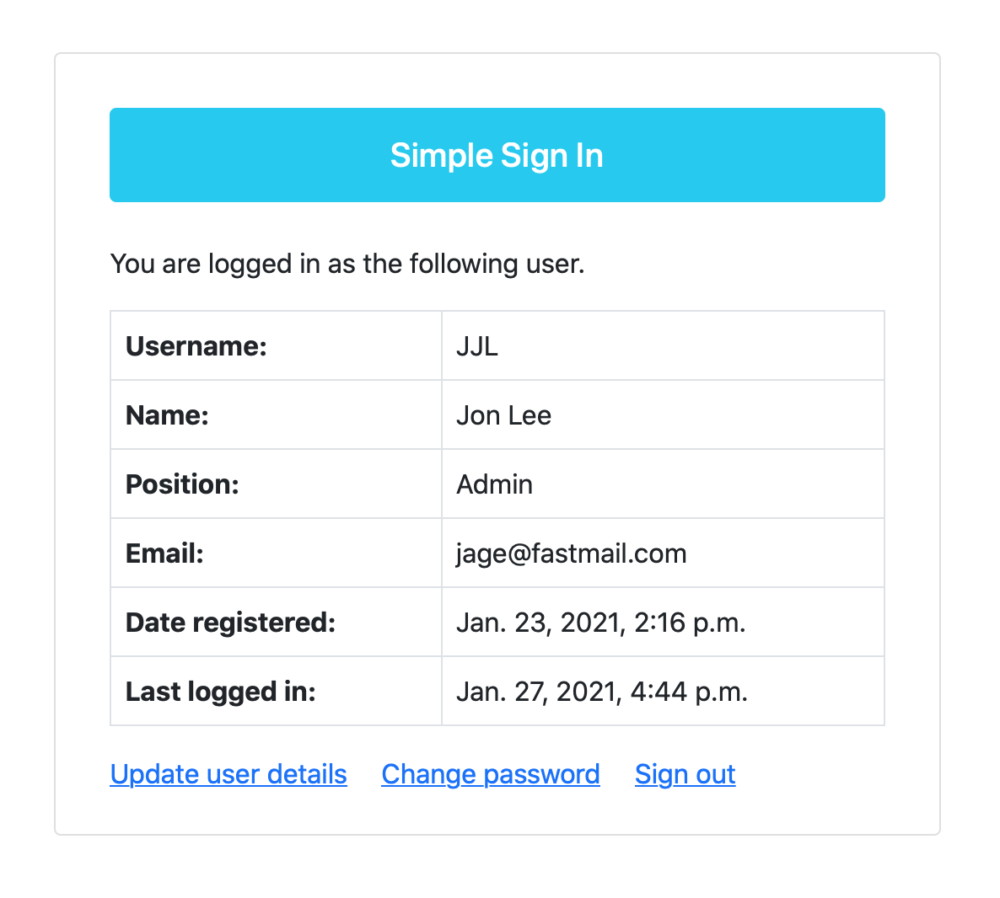

# Simple Sign In
A simple Django app for handling user sign in, sign out, register, password change, and password reset operations.

Deployed as an AWS EC2 instance using Nginx, Gunicorn, and PostgreSQL on Ubuntu 20.04. Used AWS SES to deliver email for user password resets and Certbot (Let’s Encrypt) for SSL certification.

[Live demo](https://www.simple-sign-in.app)

### Built using:

* Python 3.7.6
* Django 3.1.5
* PostgreSQL
* Gunicorn
* Nginx
* Certbot (Let’s Encrypt)
* AWS EC2
* AWS SES
* Visual Studio Code 1.52.1
* macOS 10.15.7

### Screenshots:

 
 

