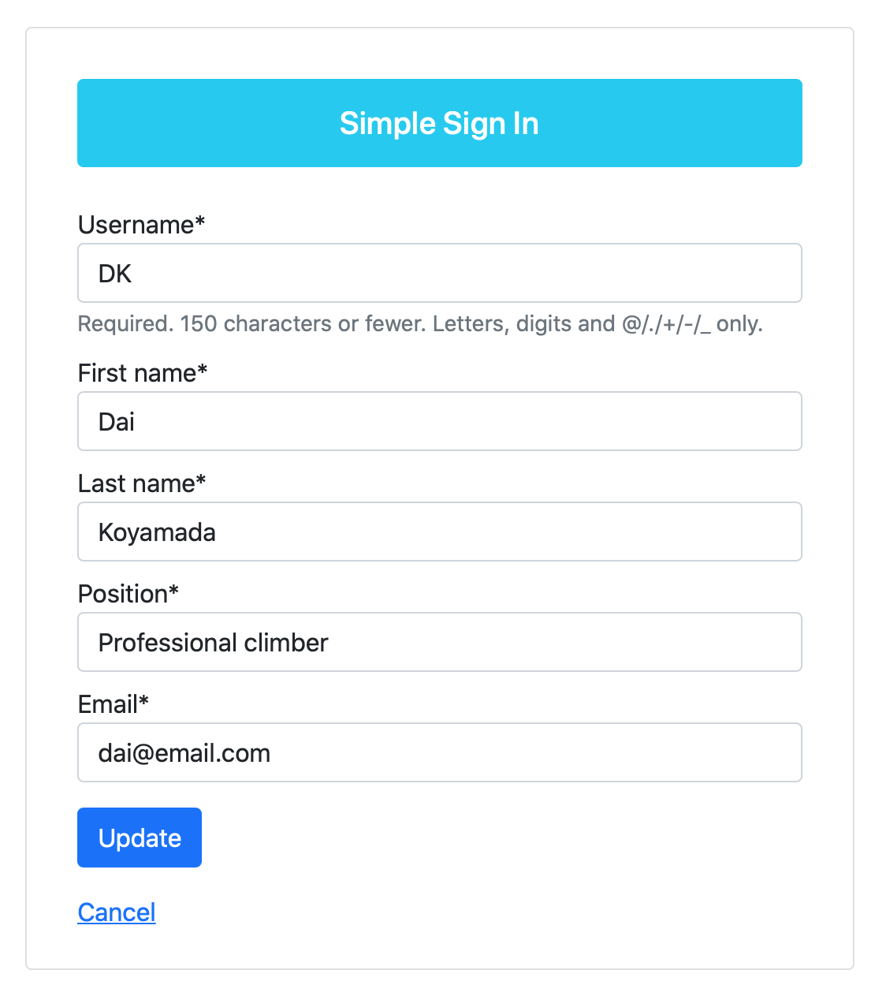
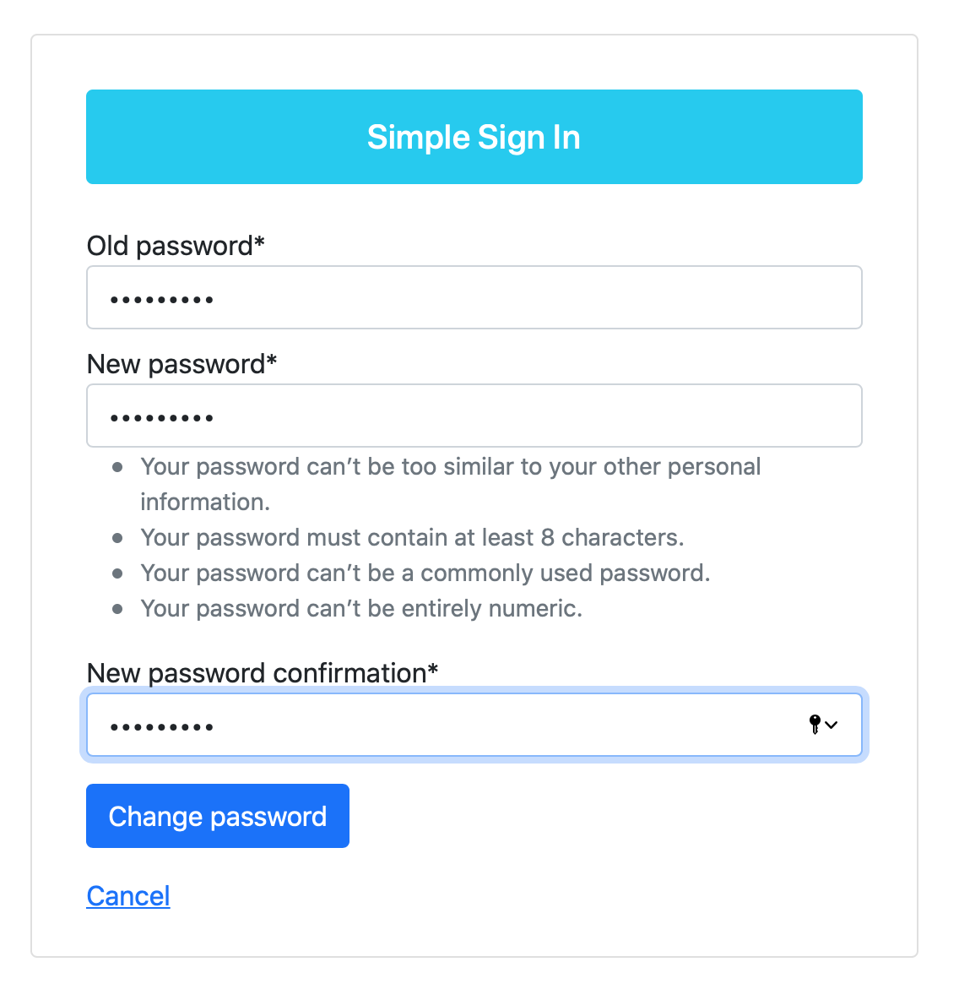
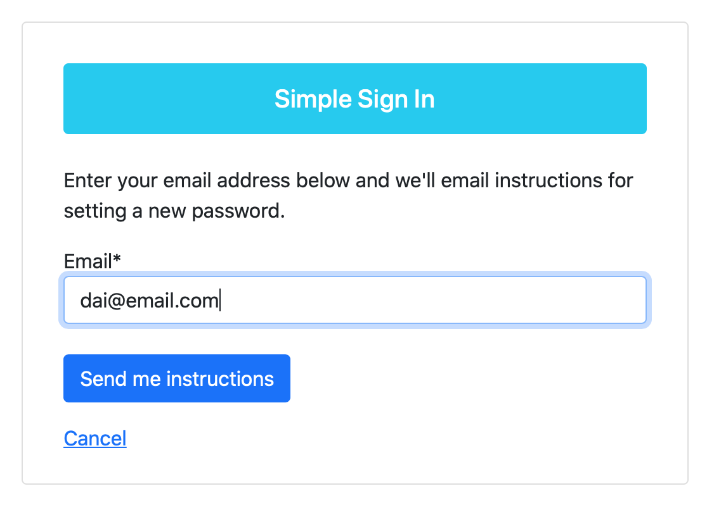

# Simple Sign In
A self-study project to satisfy my own curiosity regarding user sign-in functionality in Django and how to deploy an app as an AWS EC2 instance.

The app itself is essentially a simple Django app for handling user sign-in, sign-out, register, password change, and password reset operations. AWS SES is used to deliver email for user password resets.

The app is deployed as an AWS EC2 instance using Nginx, Gunicorn, and PostgreSQL on a Ubuntu AMI, and also uses Certbot (Let’s Encrypt) for SSL certification.

Possible improvements: Implement social authentication and allow users to upload profile images, download personal data, and delete their accounts.

[Live demo](https://www.simple-sign-in.app)

### Built using:

* Python 3.7.6
* Django 3.1.5
* Bootstrap 4
* PostgreSQL 12.5
* Gunicorn 20.0.4
* Nginx 1.18.0
* Ubuntu 20.04
* Certbot (Let’s Encrypt)
* AWS EC2
* AWS SES
* Visual Studio Code 1.52.1
* macOS 10.15.7

### Screenshots:

Sign-in: 
 

User details: 
 

Update user details: 
 

Change password: 
 

Reset password: 

